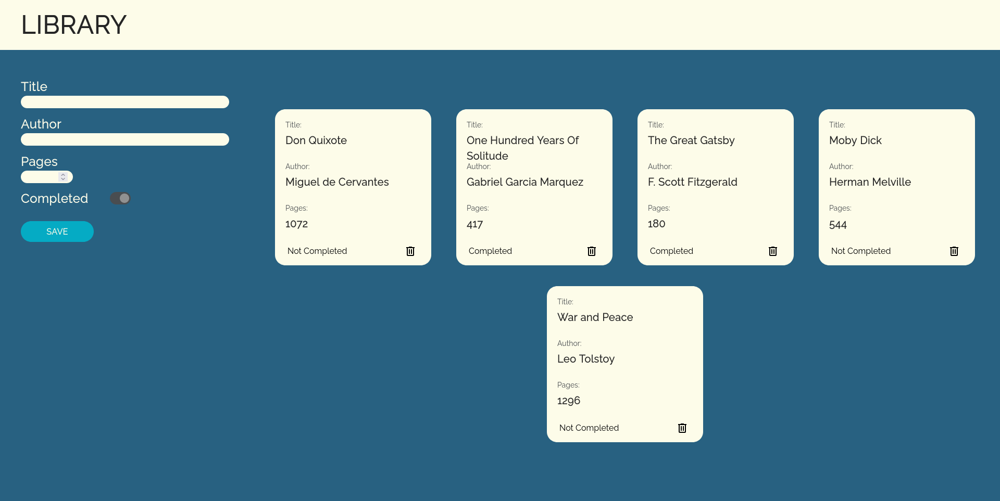

# The Odin Project - Library

This is a solution to the [Library project on The Odin Project](https://www.theodinproject.com/lessons/node-path-javascript-library). 

## Table of contents

- [Overview](#overview)
  - [The challenge](#the-challenge)
  - [Screenshot](#screenshot)
  - [Links](#links)
- [My process](#my-process)
  - [Built with](#built-with)
  - [What I learned](#what-i-learned)
  - [Continued development](#continued-development)
  - [Useful resources](#useful-resources)
- [Author](#author)

## Overview

### The challenge

Users should be able to:

- Implement a library database system using objects.
- Use lessons learned from previous chapters.

### Screenshot



### Links

- Solution URL: [https://github.com/wmartyr/top-library](https://github.com/wmartyr/top-library)
- Live Site URL: [https://wmartyr.github.io/top-library](https://wmartyr.github.io/top-library)

## My process

### Built with

- Semantic HTML5 markup
- CSS custom properties
- Flexbox
- CSS Grid

### What I learned

I had a hard time saving the books to the myLibrary list. Every time I clicked save, it would start from an empty list. It turned out that the submit button would reset the page back to it's default state. I needed to add event.preventDefault() so it would stop the default behavior of the submit button.

```js
saveButton.addEventListener("click", (event) => {
    event.preventDefault();
    addBookToLibrary();
    EraseInput();
});
```

### Continued development

I would need more practice in doing objects and DOM manipulation to hammer these lessons home.

### Useful resources

- [https://www.w3schools.com](https://www.w3schools.com) - This site has helped me countless times with syntax and other things.
- [https://www.canva.com](https://www.canva.com) - This website is what I used to create the initial design of what I though the page would look.
- [https://css-tricks.com/snippets/css/complete-guide-grid](https://css-tricks.com/snippets/css/complete-guide-grid) - This page is my goto reference for CSS Grid.
- [https://materialdesignicons.com](https://materialdesignicons.com) - This is where I got the icons.

## Author

- Github - [Woodrow Martyr](https://github.com/wmartyr)
